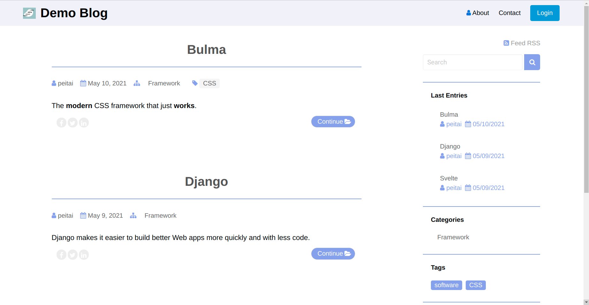

Introduction
===========
This program is based on [puput](https://github.com/APSL/puput "puput"), a Django app,  to handle the blog. It also uses the [bulma](https://bulma.io/ "bulma") and Vanilla Javascript to replace the bootstrap4 and jquery that puput used for frondend. In order to support markdown, the package, [wagtail-markdown](https://github.com/torchbox/wagtail-markdown "wagtail-markdown"), should be installed.   

Technical background
=================
- Bulma :  The modern CSS framework.
- Puput :  The blog app which is based on Wagtail CMS.
- Overwritting the templates, html and css of Puput to make a simple and clean blog.

The new in the Wagtail CMS admin page for Puput
==========
- Easily configure the color of  label, head and  body without modiying code.
- Support background image
- Support youtube link as a page title.
- Support markdown in the body. 

Installation
========
**Clone this repository and go into the directory**
```
$ git clone  https://github.com/Pei2tech/Django-Puput-Bulma-Demo.git myproject
$ cd myproject
```
**Install dependence packages**  (ps: it is recommended to use the virtual environment)  

```  
$pip install -r requirements.txt
```  

for security issue, please use below command to get security key and then update it in the setting.py.  

```  
$python -c 'from django.core.management.utils import get_random_secret_key; print(get_random_secret_key())'
```  

Configure Database
=========
```   
$cd Myblog
...Myblog$python manage.py makemigrations
...Myblog$python manage.py migrate
...Myblog$python manage.py createsuperuser
```    

**please input the user name, email address and password.**

Run on local
=========
```
..Myblog$python manage.py runserver
```

You will get **Page not found** error as the first time to run `python manage.py runserver` because there is no data in the database.
Now you can check on the admin page to configure the blog. Just open your browser at  [http://127.0.0.1:8000/cms](http://127.0.0.1:8000/cms).

**Note:** The demo just uses the name *blog* as the default homepage, please input the value *blog* for the slug in the **PROMOTE tab** as configuring the blog page. 

You may visit [Wagtail Editor’s guide](https://docs.wagtail.io/en/stable/editor_manual/index.html "Wagtail Editor’s guide") for the details about how to use Wagtail editor’s dashboard.

Screenshot
=========



Example site
=============

Example Site (traditional chinese): [TRANS](https://trans.cmssds.org/bulletin)
